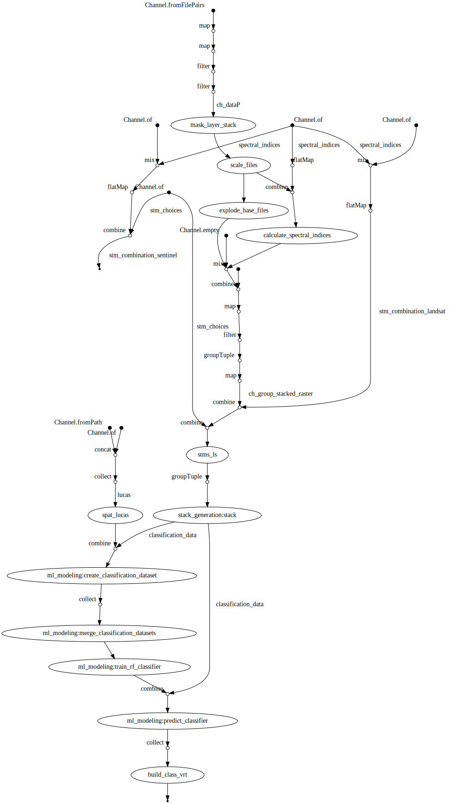

# New B5 Workflow

As per our proposal submitted to LPS22, the goals set are:
(1) to map annual land cover between 2000 and 2020 across Germany using integrated Landsat and 
Sentinel-2 times series and the harmonized European-wide Land Use and Coverage Area frame Survey (LUCAS) (d’Andrimont et al. 2020)
(2) to develop Nextflow workflows that leverage a broad range of existing, already widely used open source tools and programs and
(3) to evaluate the execution performance of Nextflow workflows.

This Readme serves a reference as to what has been accomplished, but also as a place to gather ideas/thoughts
that occurred throughout the work on this project. 

## Ready, Set, Go!

```bash
git clone https://github.com/CRC-FONDA/geoflow.git
cd geoflow
```

## Docker

We are making use of Docker containers to keep all dependencies (apart from Nextflow) together. And run the
workflow containerized.

### General

- `docker build` does not complete without warnings. However, as far as I know, these are things 
regarding the (recommended) way of installing dependencies such as the [EnMap-Box](https://bitbucket.org/hu-geomatics/enmap-box/src/develop/)
and thus, cannot be fixed on our side. 
- The container is based on the official QGIS container with the EnMap-Box added

```bash
docker build -t geoflow:latest -f Dockerfile .

docker run --rm geoflow:latest
#> QGIS Processing Executor - 3.23.0-Master 'Master' (3.23.0-Master)
#> Usage: qgis_process [--help] [--version] [--json] [--verbose] [command] [algorithm id or path to model file] [parameters]
#>
#> Options:
#>         --help or -h            Output the help
#>         --version or -v         Output all versions related to QGIS Process
#>         --json          Output results as JSON objects
#>         --verbose       Output verbose logs
# [...]
```

### Dockerhub and GitHub Actions

- I copied together a GitHub workflow which builds the container and pushes it to Dockerhub. If there's
no error, then the build and push should be relatively fast because it uses the GitHub build cache
- The image can be pulled via:

```bash
docker pull floriankaterndahl/geoflow:latest
```

## "Land use and land cover survey" data

Currently, the workflow relies on [the harmonized LUCAS survey data](https://doi.org/10.1038/s41597-020-00675-z). Which can
be downloaded [here](https://jeodpp.jrc.ec.europa.eu/ftp/jrc-opendata/LUCAS). While in the development phase
(i.e. right now), only points sampled in 2018 and the theoretical LUCAS-points are considered. This
likely changes in the future. The respective files can be downloaded in a zipped format:

```bash
wget --directory-prefix=lucas --content-disposition https://jeodpp.jrc.ec.europa.eu/ftp/jrc-opendata/LUCAS/LUCAS_harmonised/1_table/lucas_harmo_uf_2018.zip && \
  unzip lucas/lucas_harmo_uf_2018.zip -d lucas && \
  rm lucas/lucas_harmo_uf_2018.zip

wget --directory-prefix=lucas --content-disposition https://jeodpp.jrc.ec.europa.eu/ftp/jrc-opendata/LUCAS/LUCAS_harmonised/2_geometry/LUCAS_th_geom.zip && \
  unzip lucas/LUCAS_th_geom.zip -d lucas && \
  ogr2ogr -f "GPKG" lucas/lucas_geom.gpkg lucas/LUCAS_th_geom.shp && \
  rm lucas/LUCAS_th_geom*
```

## Running the Workflow

- Currently, the workflow expects two additional arguments: (1) the data source and (2) a directory
where the calculated indices should be stored (in addition to the working directory created by
Nextflow).
- It's possible to configure which flags produced by FORCE should be used for a bit mask creation. For
more information, see [here](https://force-eo.readthedocs.io/en/latest/howto/qai.html#quality-bits-in-force)
- The short script `run_nf.sh` can be used to quickly run the workflow, pull the latest Docker Image
and/or pull changes from GitHub. The available flags are: **-d** for pulling the latest image from Dockerhub; **-g**
for pulling the latest changes from GitHub; **-n** to run the workflow and **-v** to run the workflow with the additional
`-with-dag` flag.

:warning::warning: When using cached results (i. e. the `-n` flag), unexpected results have been observed where files where processed more then once and thus violate assumptions cconcerning meta data. :warning::warning:

```bash
./run_nf.sh -dgn
./run_nf.sh -v
```

## DAG visualisation

The current workflow execution structure is depicted [here](img/dag.svg).



## Further Notes

It's likely, that the docker image can be further optimised. A couple of ideas include:

- Create a "docker user" to not run the image as `root`, although I don't really see the point in doing
so for our use case
- optimize image size (~ 2,5 Gb on Dockerhub)
  - don't use the qgis base image, but compile QGIS ourselves. There's a guide on how to do this in
  the [QGIS GitHub repo](https://github.com/qgis/QGIS/blob/master/INSTALL.md)
  - use Alpine Linux as our Distro?
    - I fiddled around with that idea and there was at least one important dependency that was not readily
    available - I can't remember which one though
